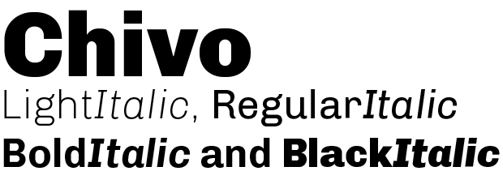

Chivo
=====

# Chivo Family  **Omnibus-Type**   *SIL Open Font License, 1.1*  Chivo is a grotesque sans serif typeface family from [Omnibus Type](http://omnibus-type.com/). It was originally designed for highlights and headlines. This family is reminiscent of late nineteenth century American typefaces.    To contribute to the project contact [Omnibus Type](http://omnibus-type.com/).  ### Designers  * Hector Gatti  ### License  Copyright (c) 2012-2014, Omnibus-Type (www.omnibus-type.com omnibus.type@gmail.com) with Reserved Font Name 'Chivo Family'.  Licensed under the [*SIL Open Font License, 1.1*](http://scripts.sil.org/OFL); you may not use this file except in compliance with the License.  ====== ## FONTLOG for the Chivo Family fonts  This file provides detailed information on the Chivo Family and Chivo Family One font software.   This information should be distributed along with the Chivo Family fonts and any derivative works.  ### Chivo Family is a typeface family that supports Unicode language range:   * Basic Latin (95 glyphs), * Latin-1 Supplement (96 glyphs), * Latin Extended-A (128 glyphs), * Latin Extended-B (7 glyphs), * Spacing Modifier Letters (9 glyphs), * Latin Extended Additional (8 glyphs), * General Punctuation (32 glyphs), * Superscripts and Subscripts (1 glyphs), * Currency Symbols (4 glyphs), * Letterlike Symbols (6 glyphs), * Number Forms (4 glyphs), * Arrows (7 glyphs), * Mathematical Operators (17 glyphs), * Miscellaneous Technical (4 glyphs), * Alphabetic Presentation Forms (2 glyphs)  *To contribute to the project contact Omnibus-Type at omnibus.type@gmail.com*  **ChangeLog**  **09 Sept 2014 (Hector Gatti &amp; Nicolas Silva) Chivo Family v1.002**  - Added Light and Bold fonts with Adobe Latin 3 character set  **30 Nov 2011 (Hector Gatti &amp; Igino Marini) Chivo Family v.1.000** - Initial release under SIL Open Font License  Block              | Range -------------------|-------------- Basic Latin        | U+0020-U+007E Latin-1 Supplement | U+00A0-U+00FF Latin Extended-A   | U+0100-U+017F    - Character map to support MS Codepages:     - 1252 Latin-1   - 1250 Latin-2 (Easter Europe)   - 1254 Turkish   - 1257 Windows Baltic   - Mac Roman  ### Acknowledgements  If you make modifications be sure to add your name (N), email (E), web-address (if you have one) (W) and description (D). This list is in alphabetical order.  **N:** **Hector Gatti** **E:** omnibus.type@gmail.com **W:** http://www.omnibus-type.com **D:** Designer  **N:** **Igino Marini** **E:** mail@iginomarini.com **W:** http://www.ikern.com **D:** Spacing and Kerning  **N:** **Nicolas Silva**   **E:** omnibus.type@gmail.com   **W:** http://www.omnibus-type.com   **D:** Typeface development (AL3 support)    **N:** **Pablo Cosgaya**   **E:** omnibus.type@gmail.com   **W:** http://www.omnibus-type.com   **D:** Designer
