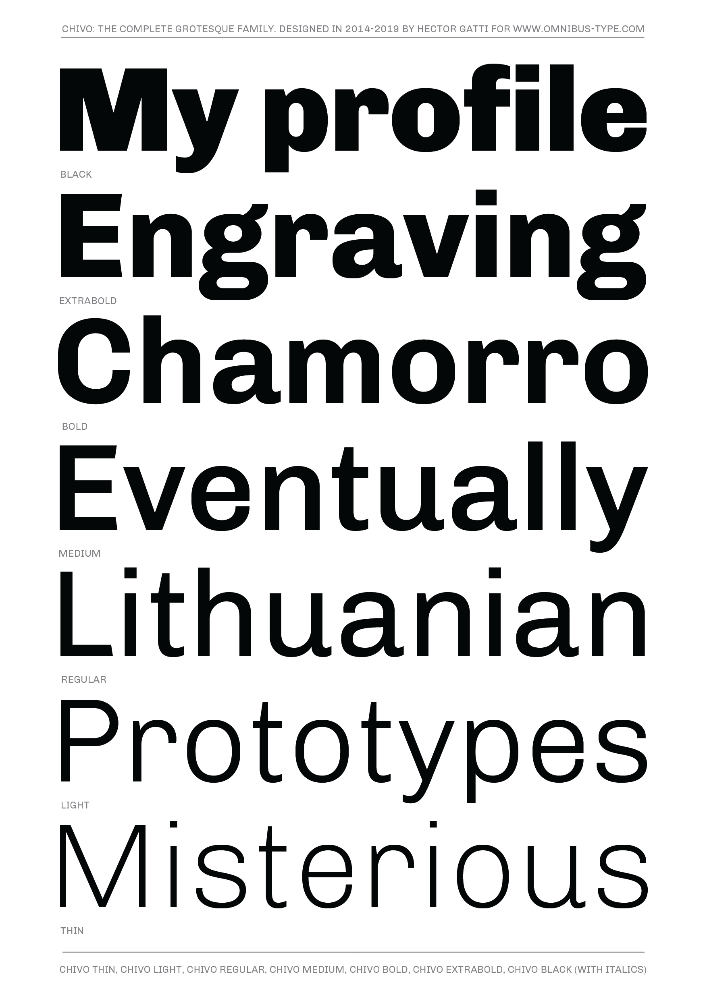
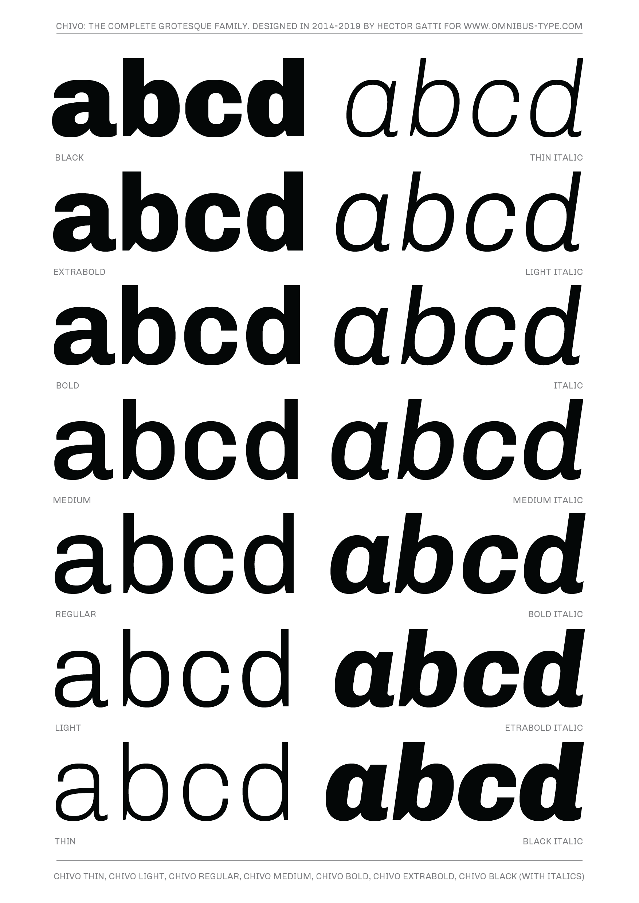

# Chivo Family

**Gatti & Omnibus-Type Team**
*SIL Open Font License 1.1,*
*14 fonts, 843 glyphs each variant*

Chivo (‘goat’ in Spanish) is the first Omnibus-Type neo-grotesque typeface family. It has 7 weight variants, plus matching italics. Its solidness and balanced strokes give Chivo both elegance and practicality. Chivo Regular works perfectly in long-reading texts, while Chivo Black is ideal for headlines, banners and highlights. Developed by Héctor Gatti, this is an indispensable ally for any designer.

#### Chivo Family contains:
* thin /  thin italic
* light / light italic
* regular / italic
* medium / medium italic
* bold / bold italic
* extrabold / extrabold italic
* black / black italic

To contribute to the project contact [Omnibus Type](http://omnibus-type.com/).

### Designers

* Héctor Gatti

### License

Copyright (c) 2019, Omnibus-Type (www.omnibus-type.com | omnibus.type@gmail.com).

Licensed under the [*SIL Open Font License, 1.1*](http://scripts.sil.org/OFL); you may not use this file except in compliance with the License.

======
## FONTLOG for the Chivo Family fonts

This file provides detailed information on the Chivo Family and Chivo Family One font software.  
This information should be distributed along with the Chivo Family fonts and any derivative works.

### Chivo Family is a typeface family that supports Unicode language range: 

* Basic Latin (95 glyphs),
* Latin-1 Supplement (96 glyphs),
* Latin Extended-A (128 glyphs),
* Latin Extended-B (7 glyphs),
* Spacing Modifier Letters (9 glyphs),
* Latin Extended Additional (8 glyphs),
* General Punctuation (32 glyphs),
* Superscripts and Subscripts (1 glyphs),
* Currency Symbols (4 glyphs),
* Letterlike Symbols (6 glyphs),
* Number Forms (4 glyphs),
* Arrows (7 glyphs),
* Mathematical Operators (17 glyphs),
* Miscellaneous Technical (4 glyphs),
* Alphabetic Presentation Forms (2 glyphs)

*To contribute to the project contact Omnibus-Type at omnibus.type@gmail.com*

**ChangeLog**

**31 October 2018 Chivo Family v1.007**
- New weights: thin, thin italic, medium, medium italic, extrabold, extrabold italic
- Updated to GF Latin Plus set
- Supports 219 Latin languages used in 212 countries

**17 February 2016 (Nicolás Silva) Chivo Family v1.004**  
- Name tables adjusted for better compatibility with Microsoft Word for Mac  
- fsType Installable Mode

**30 January 2015 (Nicolás Silva) Chivo Family v1.003**  
- Removed Reserve Font Name from the license  
- Name tables adjusted  
- fsType Installable Mode  
- Set Panose values  
- Updates CFF and TTF hinting  
- Added Family Alignment Zones  
- New Verical Metrics  

**09 Sept 2014 (Héctor Gatti & Nicolás Silva) Chivo Family v1.002** 
- Added Light and Bold fonts with Adobe Latin 3 character set

**30 Nov 2011 (Héctor Gatti & Igino Marini) Chivo Family v.1.000**
- Initial release under SIL Open Font License

Block              | Range
-------------------|--------------
Basic Latin        | U+0020-U+007E
Latin-1 Supplement | U+00A0-U+00FF
Latin Extended-A   | U+0100-U+017F

 
- Character map to support MS Codepages:  
  - 1252 Latin-1
  - 1250 Latin-2 (Easter Europe)
  - 1254 Turkish
  - 1257 Windows Baltic
  - Mac Roman

### Acknowledgements

If you make modifications be sure to add your name (N), email (E), web-address
(if you have one) (W) and description (D). This list is in alphabetical order.

**N:** **Héctor Gatti**  
**E:** omnibus.type@gmail.com  
**W:** http://www.omnibus-type.com  
**D:** Designer  

**N:** **Igino Marini**  
**E:** mail@iginomarini.com  
**W:** http://www.ikern.com  
**D:** Spacing and Kerning  

**N:** **Nicolás Silva**  
**E:** omnibus.type@gmail.com  
**W:** http://www.omnibus-type.com  
**D:** Typeface development (AL3 support)  

**N:** **Pablo Cosgaya**  
**E:** omnibus.type@gmail.com  
**W:** http://www.omnibus-type.com  
**D:** Designer
